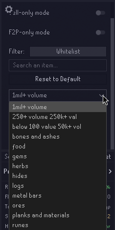

# Flipping Copilot

----------------------------------------------------------------------------------
## THIS IS A JANKY FORK
This fork is a mod of the Flipping Copilot OSRS client plugin. I made this fork because there were features I wanted and because I wanted a project for testing LLM coding capabilities. All changes to this project were made using Anthropic Claude-Sonnet 3.5 along with [Open Hands](https://github.com/All-Hands-AI/OpenHands). I HAVE NO IDEA WHAT I AM DOING. I WILL NOT HELP YOU. I WILL ALMOST CERTAINLY NOT FIX ANY BUGS YOU ENCOUNTER. Discord: .tekis RSN: buttpee

USE AT YOUR OWN RISK. THIS VERSION OF THE CLIENT IS NOT ENDORSED BY THE COPILOT DEVS. DO NOT ASK THE DEVS OF THE FLIPPING COPILOT PLUGIN FOR HELP IF YOU CHOOSE TO USE THIS FORK.
----------------------------------------------------------------------------------

Flipping Copilot is an AI-powered assistant designed to enhance your trading experience in Old School RuneScape. With its advanced algorithms and market analysis, Flipping Copilot provides intelligent suggestions on which items to flip, optimal prices and quantities for buying and selling, and when to cancel existing offers to maximize your profit per hour.

## Community
Join our [Discord server](https://discord.gg/UyQxA4QJAq) to engage with fellow users, discuss the project, ask questions, and receive support. Our community is dedicated to helping you make the most of Flipping Copilot and enhancing your trading experience in Old School RuneScape.

## Features
 - Intelligent item suggestions
 - Optimal price and quantity suggestions
 - Real-time offer cancellation suggestions
 - Profit and loss tracking
## Mod Features
 - expanded blacklisting features
  - Blacklist / whitelist toggle
  - Export / Import blacklist and whitelist configurations
  - Invert blacklist selection
  - Pre-made selection of high volume or resource specific white lists
----------------------------------------------------------------------------------

## Attribution
Icons were created by cbrewitt or sourced from Flaticon. The following attributions are provided in accordance with the Flaticon license agreement.
<a href="https://www.flaticon.com/free-icons/internet" title="internet icons">Internet icons created by Freepik - Flaticon</a>

Some code was used from Runelite Plugins (BSD 2-Clause License):
- [Flipping Utilities](https://github.com/Flipping-Utilities/rl-plugin?tab=readme-ov-file)
- [Flipper](https://github.com/OkayestDev/OSRS-Flipper)
- [Discord Level Notifications](https://github.com/ATremonte/Discord-Level-Notifications)
